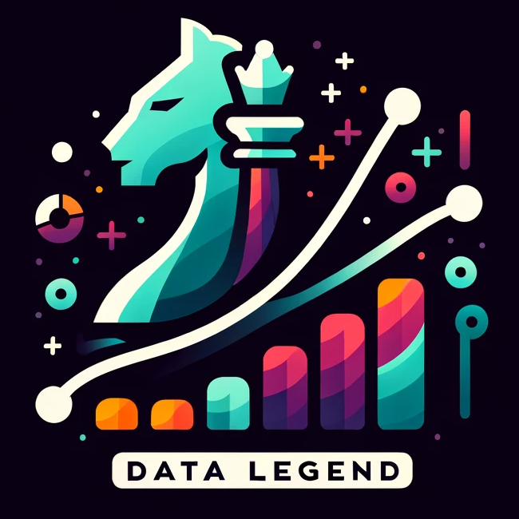

  

# TFT Data Legend

## Overview
**TFT Data Legend** is a data analytics project designed for players of **Teamfight Tactics (TFT)**. This initiative focuses on harnessing the power of extensive in-game data to provide deep insights and accurate predictions, empowering players to refine their strategies and gameplay.

### Project Roadmap
- **Advanced Statistical Analysis**: Dive into comprehensive data-driven insights to understand game dynamics.
- **Interactive Visualizations**: Engage with intuitive and detailed visual representations of game data.
- **Predictive Modeling**: Utilize machine learning models to predict game outcomes and player performance.
